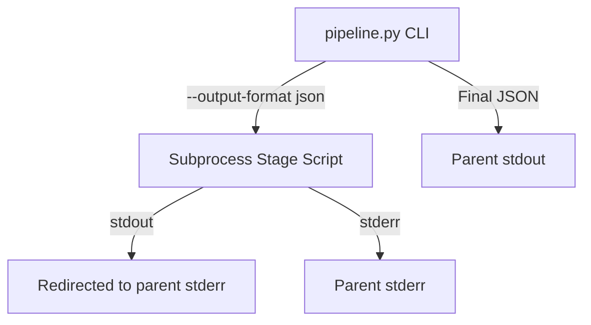

# Phase 3 Research: Structured CLI Interoperability

## 1. Domain Analysis

### 1.1 stdout vs stderr Stream Separation
In UNIX-like operating systems and professional developer tools, standard output (`stdout`) and standard error (`stderr`) serve distinct purposes:
- **stdout (Standard Output)**: Intended for programmatic consumption, final structured output, or pipelined data (e.g., `paper2code ... | jq`).
- **stderr (Standard Error)**: Intended for interactive logging, diagnostics, progress indicators, warnings, and error traces.

When integrating with external automated harnesses such as `meta-harness` or `OrCAID`, the harness captures `stdout` to parse the execution summary (typically JSON). Any non-JSON output on `stdout` (such as print statements, model reasoning thoughts, loading spinners, or database status messages) will pollute the output stream and cause JSON parsing failures in the harness.

### 1.2 Programmatic Command Line Interfaces
Command-line arguments in Python are typically managed via the standard `argparse` library. For interoperability, the CLI must:
- Accept specific control flags (e.g., `--output-format`, `--stages`, `--model`).
- Standardize stage-based execution by parsing comma-separated lists of stages (e.g., `planning,analyzing,coding,debugging`).
- Propagate parameters (like target model or run ID) down to all sub-stages.

---

## 2. Architecture Mapping

### 2.1 Parent-Child Output Redirection
Since Phase 3 executes sub-stages as subprocesses (prior to Phase 4's in-memory execution refactoring), we can achieve absolute stdout isolation by controlling the stream redirection of spawned processes.

When executing a stage subprocess via Python's `subprocess` module:
- Passing `stdout=sys.stderr` ensures all child standard print outputs are written to the parent's `stderr`.
- Passing `stderr=sys.stderr` propagates all error logs directly to the parent's `stderr`.
- The parent process maintains a clean `stdout` write at the very end to output the machine-readable `PipelineResult` JSON.

### 2.2 CLI Parsing and Stages Mapping
The orchestrator in `codes/pipeline.py` will parse:
- `--stages`: A comma-separated string that determines which stage subprocesses to trigger:
  - `planning`: Runs `1_planning.py` and `1.1_extract_config.py`.
  - `analyzing`: Runs `2_analyzing.py`.
  - `coding`: Runs `3_coding.py`.
  - `debugging`: Runs `4_debugging.py` (which requires `--error_file_path`).
- `--model` (or `--gpt_version` to match children): Overrides `LLM_MODEL` at runtime.
- `--output-format`: Emits either clean `json` (only the result JSON to `stdout`, everything else to `stderr`) or `human` (readable lines to `stdout`).

---

## 3. Verification Strategy

### 3.1 Automated Validation
We will create a structured test suite in `tests/test_cli_interop.py` that validates:
1. **Arg Parsing**: Ensures invalid flags or stages return standard non-zero exit codes.
2. **Stream Separation**:
   - Executes `pipeline.py --output-format json` and captures `stdout` and `stderr` independently.
   - Asserts that `stdout` is a single, valid JSON block.
   - Asserts that `stdout` contains no logging prefixes (like `[db]`, `[executor]`, or `[Planning]`).
   - Asserts that progress logs appear in `stderr`.
3. **Stage Filtering**: Asserts that only the selected stages are run (by inspecting the database run records or sub-stage outputs).
