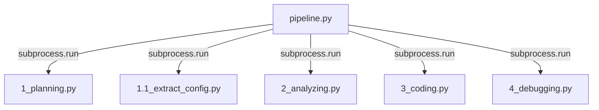
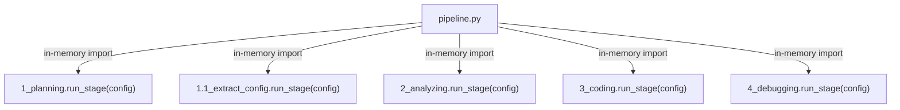

# Phase 4 Research: Programmatic Pipeline Orchestration

## 1. Context & Architecture

Phase 4 transitions the **Paper2Code-Enhanced** pipeline from a subprocess-driven CLI wrapper to a pure, in-memory Python library that can be integrated directly with meta-harnesses (`OrCAID`, `hermes`). 

### Currently Spawning Pattern:


### Proposed In-Memory Pattern:


---

## 2. Interface Design

To support both programmatic imports and backward-compatible standalone CLI executions, all stage scripts will expose a unified programmatic entry point:

```python
def run_stage(config) -> None:
    """
    Exposes the core execution loop of the stage.
    Accepts any namespace-like config (duck typing).
    """
```

### Stage Script Refactoring Mapping

To prevent circular imports, `config` properties will be retrieved using robust `getattr(config, ...)` defaults:

| Stage Script | Stage Name | Parameters Checked on `config` |
|--------------|------------|--------------------------------|
| `1_planning.py` | `planning` | `paper_name`, `model/gpt_version`, `paper_format`, `pdf_json_path`, `pdf_latex_path`, `output_dir`, `run_id` |
| `1.1_extract_config.py` | `extract_config` | `paper_name`, `output_dir` |
| `2_analyzing.py` | `analyzing` | `paper_name`, `model/gpt_version`, `paper_format`, `pdf_json_path`, `pdf_latex_path`, `output_dir`, `run_id` |
| `3_coding.py` | `coding` | `paper_name`, `model/gpt_version`, `paper_format`, `pdf_json_path`, `pdf_latex_path`, `output_dir`, `output_repo_dir`, `run_id` |
| `4_debugging.py` | `debugging` | `error_file_path/error_file_name`, `output_dir`, `paper_name`, `output_repo_dir`, `model`, `debug_save_num/save_num`, `run_id` |

---

## 3. Packaging & Global CLI Installation

To make `Paper2Code-Enhanced` a command-line script executable globally as `paper2code`, we will configure the packaging entrypoint inside `pyproject.toml`.

### Entrypoint definition:
```toml
[project.scripts]
paper2code = "codes.pipeline:main"
```

Because `pipeline.py` resides inside the `codes` directory, the module import path from the root workspace is `codes.pipeline`.
We must ensure `codes/` acts as a proper package by verifying `__init__.py` file presence and standardizing path resolutions (`sys.path.insert` or absolute imports) to prevent module resolution errors.
