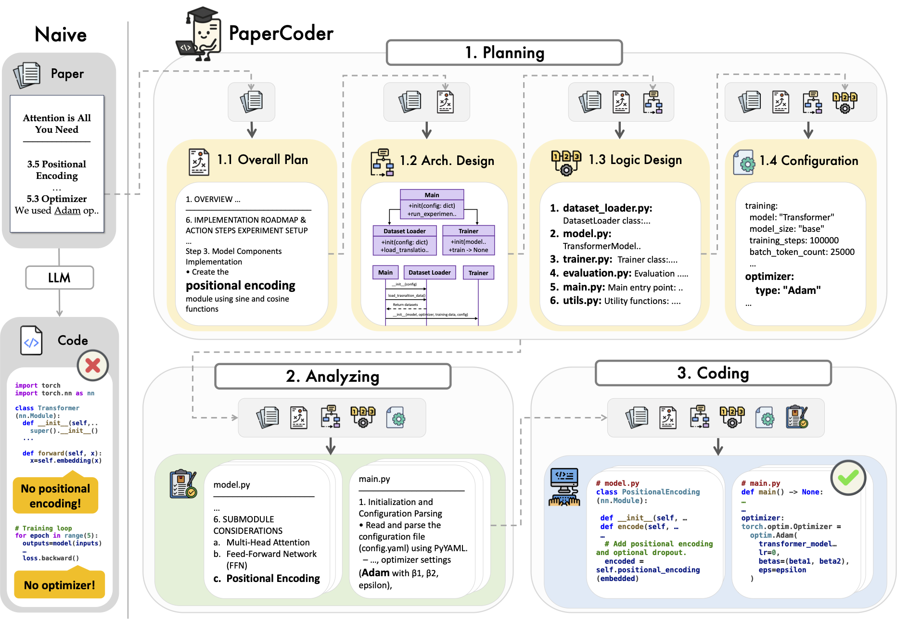

# 📄 Paper2Code: Automating Code Generation from Scientific Papers in Machine Learning

**Minju Seo, Jinheon Baek†, Seongyun Lee, and Sung Ju Hwang†** († denotes equal advising)
International Conference on Learning Representations (ICLR), 2026
📄 [Read the paper](https://arxiv.org/abs/2504.17192)



**PaperCoder** is the multi-agent LLM system introduced in **Paper2Code**, designed to transform a paper into a code repository.
It follows a three-stage pipeline: planning, analysis, and code generation, each handled by specialized agents.
Our method outperforms strong baselines on both Paper2Code and PaperBench and produces faithful, high-quality implementations.

---

## 🗺️ Table of Contents

- [⚡ Quick Start](#-quick-start)
- [📚 Detailed Setup Instructions](#-detailed-setup-instructions)
- [📦 Paper2Code Benchmark Datasets](#-paper2code-benchmark-datasets)
- [📊 Model-based Evaluation of Repositories](#-model-based-evaluation-of-repositories-generated-by-papercoder)

---

## ⚡ Quick Start

- **Note**: The following command runs the example paper ([Attention Is All You Need](https://arxiv.org/abs/1706.03762)).
- For more setup options, including direct PDF ingestion, LaTeX-based inputs, and visual OCR conversion, see [📚 Detailed Setup Instructions](#-detailed-setup-instructions).

### Using `uv` (Recommended)

This repository is managed as a `uv` project. `uv` ensures reproducible virtual environments, ultra-fast installs, and clean dependency management.

```bash
# 1. Install uv (if you haven't already)
curl -LsSf https://astral.sh/uv/install.sh | sh

# 2. Sync virtual environment and install all dependencies (including Anthropic and OpenAI SDKs)
uv sync

# 3. Copy the environment configuration template
cp .env.example .env

# 4. Fill in your preferred model settings in `.env` (MiniMax M2.7, OpenRouter, OpenAI, or local Ollama)
# Open .env and set your LLM_API_KEY, LLM_MODEL, and LLM_BASE_URL.

# 5. Run PaperCoder
cd scripts
uv run bash run.sh
```

> [!TIP]
> All Python scripts in this pipeline automatically load environment variables from the `.env` file in the root directory via `python-dotenv`. You don't need to manually export variables in your shell!

### 🌐 Unified Model & Provider Setup

Paper2Code uses a unified, OpenAI-compatible client wrapper that works with almost all major LLM providers. 

To configure a provider, uncomment and fill in the corresponding block in your `.env` file:

> [!NOTE]
> **Thinking/Reasoning Blocks Support**: The pipeline natively supports models with advanced thinking blocks (e.g., MiniMax M2.7). If the model name contains `minimax` and the `anthropic` Python package is installed (default via `uv sync`), the pipeline automatically uses the Anthropic SDK client wrapper under the hood to capture these reasoning steps perfectly!

#### 🚀 Option A: MiniMax M2.7 (Recommended for Reasoning)
```env
LLM_API_KEY=your_minimax_api_key_here
LLM_BASE_URL=https://api.minimax.io/anthropic
LLM_MODEL=MiniMax-M2.7
```

#### 🔗 Option B: OpenRouter
```env
LLM_API_KEY=your_openrouter_api_key_here
LLM_BASE_URL=https://openrouter.ai/api/v1
LLM_MODEL=minimax/minimax-m1-40k
```

#### 🏠 Option C: Ollama (Local / Offline)
```env
LLM_API_KEY=ollama
LLM_BASE_URL=http://localhost:11434/v1
LLM_MODEL=llama3.2
```

#### 🟢 Option D: OpenAI
```env
LLM_API_KEY=your_openai_api_key_here
LLM_BASE_URL=
LLM_MODEL=gpt-4o
# LLM_REASONING_EFFORT=medium  # Set to low, medium, or high for OpenAI o-series models (e.g. o3-mini)
```

### Legacy Pip Installation

If you prefer using traditional virtual environments and standard `pip`:

```bash
pip install -r requirements.txt
cp .env.example .env  # configure your .env file
cd scripts
bash run.sh
```

### Output Folder Structure (Only Important Files)

```bash
outputs
├── Transformer
│   ├── analyzing_artifacts
│   ├── coding_artifacts
│   └── planning_artifacts
│   └── accumulated_cost.json
└── Transformer_repo # Final output repository
```

---

## 📚 Detailed Setup Instructions

### 🛠️ Environment Setup

- 💡 To use the `o3-mini` version or MiniMax, ensure you have set the appropriate environment variables.
- We recommend using `uv` to manage your environment:

```bash
uv sync
```

- Alternatively, you can use pip:

```bash
pip install -r requirements.txt
```

### 📄 Modernized PDF Ingestion & OCR

Paper2Code features a powerful, direct PDF ingestion layer that bypasses the legacy Java-based `s2orc-doc2json` pipeline. It supports offline parsing, API-driven Vision-Language Model structure refinement, and high-fidelity visual OCR.

To ingest and clean any academic PDF, run the following:

```bash
python codes/0_pdf_process.py \
    --input_json_path path/to/paper.pdf \
    --output_json_path path/to/output_cleaned.json \
    --mode auto
```

#### Ingestion Modes (`--mode`):

*   **`auto` (Default)**: Automatically detects if an API key is available. If so, uses **VLM refinement** for maximum structure accuracy. If not, falls back to **local extraction**.
*   **`vlm`**: Leverages Vision-Language Models (configured via `.env`) to process raw extracted text, automatically converting complex math equations to native **LaTeX** ($...$ or $$...$$) and tables to clean Markdown format while preserving exact scientific details.
*   **`local`**: Zero-dependency local text extractor utilizing `pypdf`. Safe, completely offline, and extremely fast.
*   **`olmocr`**: A wrapper for Allen Institute for AI's visual-centric **olmOCR** pipeline (`python -m olmocr.pipeline`) if installed.

#### Legacy Grobid JSON Support:

If you already have a structured JSON produced by legacy Grobid/`s2orc-doc2json`, you can process and clean it using the same script:

```bash
python codes/0_pdf_process.py \
    --input_json_path path/to/grobid_paper.json \
    --output_json_path path/to/output_cleaned.json
```

### 🚀 Running PaperCoder

- Note: The following command runs example paper ([Attention Is All You Need](https://arxiv.org/abs/1706.03762)).
  If you want to run PaperCoder on your own paper, please modify the environment variables accordingly.

#### Using the Unified API Client (OpenAI, MiniMax, OpenRouter, etc.)

- 💵 Estimated cost for using reasoning models: $0.50–$0.70
- **Note**: Ensure you have copied and configured your `.env` file beforehand.

```bash
# Using the PDF-based JSON format of the paper
cd scripts
uv run bash run.sh
```

```bash
# Using the LaTeX source of the paper
cd scripts
uv run bash run_latex.sh
```

#### Using Open Source Models with vLLM

- The default model is `deepseek-ai/DeepSeek-Coder-V2-Lite-Instruct`.

```bash
# Using the PDF-based JSON format of the paper
cd scripts
uv run bash run_llm.sh
```

```bash
# Using the LaTeX source of the paper
cd scripts
uv run bash run_latex_llm.sh
```

---

## 📦 Paper2Code Benchmark Datasets

- Huggingface dataset: [paper2code](https://huggingface.co/datasets/iaminju/paper2code)
- You can find the description of the Paper2Code benchmark dataset in [data/paper2code](https://github.com/going-doer/Paper2Code/tree/main/data/paper2code).
- For more details, refer to Section 4.1 "Paper2Code Benchmark" in the [paper](https://arxiv.org/abs/2504.17192).

---

## 📊 Model-based Evaluation of Repositories Generated by PaperCoder

- We evaluate repository quality using a model-based approach, supporting both reference-based and reference-free settings.
  The model critiques key implementation components, assigns severity levels, and generates a 1–5 correctness score averaged over 8 samples using **o3-mini-high**.

- For more details, please refer to Section 4.3.1 (_Paper2Code Benchmark_) of the paper.
- **Note:** The following examples evaluate the sample repository (**Transformer_repo**).
  Please modify the relevant paths and arguments if you wish to evaluate a different repository.

### 🛠️ Environment Setup

Ensure your `.env` contains your active provider credentials (such as OpenAI/o3-mini or your preferred provider API keys).

### 📝 Reference-free Evaluation

- `target_repo_dir` is the generated repository.

```bash
cd codes/
uv run python eval.py \
    --paper_name Transformer \
    --pdf_json_path ../examples/Transformer_cleaned.json \
    --data_dir ../data \
    --output_dir ../outputs/Transformer \
    --target_repo_dir ../outputs/Transformer_repo \
    --eval_result_dir ../results \
    --eval_type ref_free \
    --generated_n 8 \
    --papercoder
```

### 📝 Reference-based Evaluation

- `target_repo_dir` is the generated repository.
- `gold_repo_dir` should point to the official repository (e.g., author-released code).

```bash
cd codes/
uv run python eval.py \
    --paper_name Transformer \
    --pdf_json_path ../examples/Transformer_cleaned.json \
    --data_dir ../data \
    --output_dir ../outputs/Transformer \
    --target_repo_dir ../outputs/Transformer_repo \
    --gold_repo_dir ../examples/Transformer_gold_repo \
    --eval_result_dir ../results \
    --eval_type ref_based \
    --generated_n 8 \
    --papercoder
```

### 📄 Example Output

```bash
========================================
🌟 Evaluation Summary 🌟
📄 Paper name: Transformer
🧪 Evaluation type: ref_based
📁 Target repo directory: ../outputs/Transformer_repo
📊 Evaluation result:
        📈 Score: 4.5000
        ✅ Valid: 8/8
========================================
🌟 Usage Summary 🌟
[Evaluation] Transformer - ref_based
🛠️ Model: o3-mini
📥 Input tokens: 44318 (Cost: $0.04874980)
📦 Cached input tokens: 0 (Cost: $0.00000000)
📤 Output tokens: 26310 (Cost: $0.11576400)
💵 Current total cost: $0.16451380
🪙 Accumulated total cost so far: $0.16451380
============================================
```

## 🧪 Testing and Linting

This project uses pytest for unit tests and ruff for linting.

### Running Tests

```bash
python -m pytest tests/
```

To run tests with verbose output:

```bash
python -m pytest tests/ -v
```

All 18 unit tests should pass.

### Running Linting

```bash
python -m ruff check codes/
```

The codebase passes all ruff linting checks.

## 🤝 Contributing

See [CONTRIBUTING.md](CONTRIBUTING.md) for guidelines on how to contribute to the Paper2Code project.

## 📄 License

This project is licensed under the Apache License 2.0. See the [LICENSE](LICENSE) file for the full license text.
