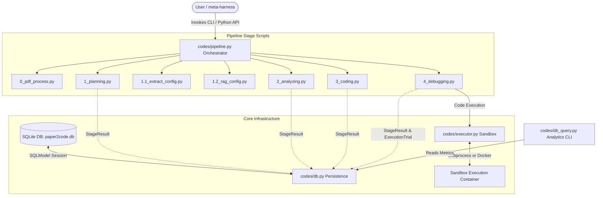

<!-- generated-by: gsd-doc-writer -->
# 🏛️ Architecture

This document provides a comprehensive overview of the system architecture and internal components of the **Paper2Code-Enhanced** pipeline.

---

## 🗺️ System Overview

**Paper2Code-Enhanced** is a modular, multi-agent AI pipeline designed to systematically convert scientific machine learning papers into clean, functional, and self-contained code repositories. The system operates as an **agentic pipeline**, utilizing advanced reasoning models (specifically optimized for MiniMax-M2.7 and OpenAI o3-mini) to plan, analyze, write, and iteratively debug code against a sandboxed execution environment. 

The pipeline takes a structured paper representation (either PDF converted to JSON format or raw LaTeX source files) as input, and outputs a complete, verified code repository along with comprehensive run execution records and analytics stored in a SQLite database.

---

## 📊 Component Diagram

The Paper2Code-Enhanced system is structured around an orchestrator, several specialized stage scripts, and three core infrastructure layers: the **Persistence Layer**, the **Execution Sandbox Layer**, and the **CLI/Analytics Engine**.



---

## 🔄 Data Flow

When running a paper conversion task, data flows through the pipeline in a well-defined sequential progression:

1. **Initialization**: The orchestrator (`pipeline.py`) initializes the database engine via `init_db()` and creates or resumes a unique pipeline run record via `create_run()`.
2. **Paper Input Preprocessing (`0_pdf_process.py`)**: The input PDF JSON or LaTeX file is loaded and prepared.
3. **Planning Stage (`1_planning.py`)**: The system parses the scientific text to draft a technical implementation strategy, generating structured planning artifacts.
4. **Config & RAG Extraction (`1.1_extract_config.py` & `1.2_rag_config.py`)**: The system extracts configuration variables and sets up Retrieval-Augmented Generation context for code writing.
5. **Analyzing Stage (`2_analyzing.py`)**: The planning artifacts are refined into a granular software design specification.
6. **Code Generation (`3_coding.py` / `3.1_coding_sh.py`)**: The system translates the design specifications into modular code files, constructing the target repository structure.
7. **Iterative Debugging / RLM (`4_debugging.py`)**:
    * The generated repository is deployed inside the isolated sandbox (`executor.py`).
    * Tests and entry points are run.
    * If execution fails, the stderr/stdout are captured and persisted as `ExecutionTrial` database records.
    * A debugging agent receives the error, modifies the code, and re-executes inside the sandbox.
    * This loops until all checks pass (convergence) or the trial limit is reached.
8. **Completion**: The orchestrator computes total run duration and aggregates model costs and token usage metrics, updating the run status to `completed` in the database.

---

## 🔑 Key Abstractions

The system enforces strict decoupling between orchestration, stage execution, sandboxed runtime environment, and database persistence. The core abstractions include:

| Abstraction | Component Location | Description |
| :--- | :--- | :--- |
| `PipelineConfig` | [codes/pipeline.py](file:///home/ty/Repositories/ai_workspace/Paper2Code-Enhanced/codes/pipeline.py#L72-L104) | Dataclass representing the single source of truth configuration for an entire end-to-end run. |
| `PipelineResult` | [codes/pipeline.py](file:///home/ty/Repositories/ai_workspace/Paper2Code-Enhanced/codes/pipeline.py#L110-L140) | Structured result container returned upon pipeline completion, supporting JSON CLI formatting. |
| `Run` | [codes/db.py](file:///home/ty/Repositories/ai_workspace/Paper2Code-Enhanced/codes/db.py#L83-L102) | SQLModel representation of a pipeline run, containing global status, durations, and aggregate costs. |
| `StageResult` | [codes/db.py](file:///home/ty/Repositories/ai_workspace/Paper2Code-Enhanced/codes/db.py#L103-L123) | SQLModel row representing a single LLM invocation in any stage, tracking exact prompt hashes and token costs. |
| `ExecutionTrial` | [codes/db.py](file:///home/ty/Repositories/ai_workspace/Paper2Code-Enhanced/codes/db.py#L124-L145) | SQLModel row representing an individual code execution attempt in the sandboxed executor, used for tracking RLM debugging convergence. |
| `Executor` | [codes/executor.py](file:///home/ty/Repositories/ai_workspace/Paper2Code-Enhanced/codes/executor.py) | Abstract base class defining containerized or local subprocess execution limits, timeouts, and volume mappings. |

---

## 📁 Directory Structure Rationale

The repository structure isolates experimental models, pipeline components, generated outputs, and verification scripts:

```
Paper2Code-Enhanced/
├── assets/          # Architecture overview images and documentation media
├── codes/           # Main Python pipeline stage scripts and core infrastructure
├── data/            # Paper2Code evaluation benchmark datasets and input files
├── docs/            # Unified system documentation (Architecture, Setup, Development)
├── examples/        # Sample paper inputs (cleaned PDFs) and golden reference repositories
├── outputs/         # Run directory where SQLite DBs, execution artifacts, and final code reside
├── scripts/         # Automated shell run configurations and batch runners
└── tests/           # Database schema validations, mock populators, and runtime test suites
```
